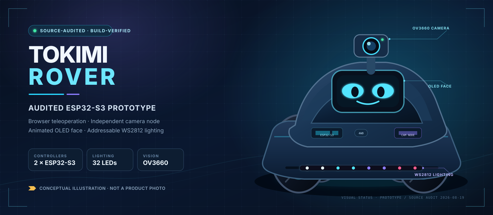
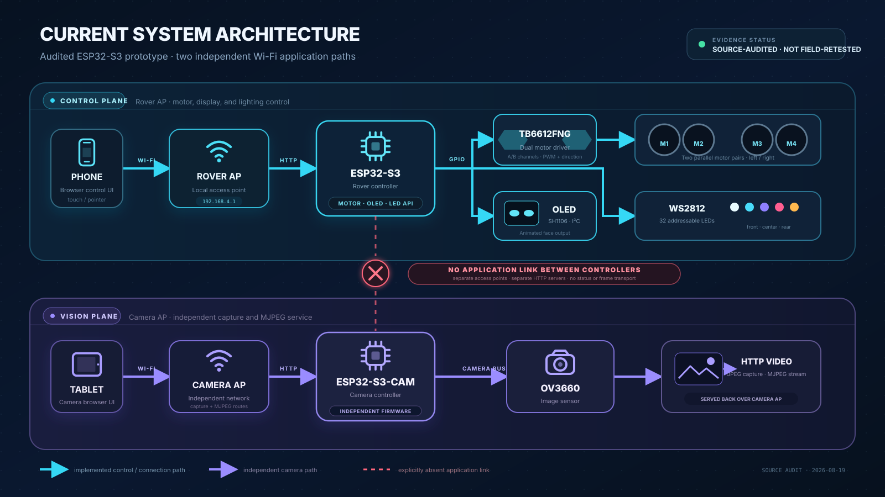
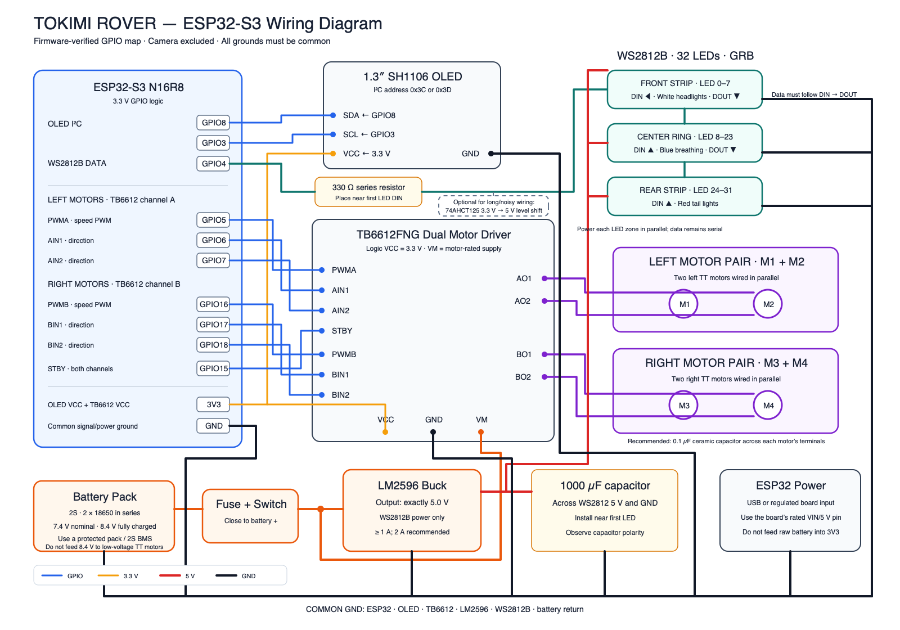

# Tokimi Rover

Tokimi Rover 是一台以 ESP32-S3 為核心的模組化 Rover 原型，整合瀏覽器遙控、獨立攝影機節點、OLED 動畫表情與 WS2812 燈光。

> **V0.1 狀態：** 原始碼與文件稽核已完成，兩個韌體專案也已從目前整理後的目錄重新乾淨建置；本次稽核**沒有重新對實車做硬體測試**。這是研究與教學用途的原型，不是量產車輛。

[English README](README.md)

## 重要安全警告

> **第一次通電、改線或更新韌體後，必須先把驅動輪架空，並把馬達電源的實體斷電方式放在手邊。** 目前 TB6612FNG 曾在四顆馬達持續負載下出現疑似過熱保護；韌體 PWM 上限是 80%，沒有電流／溫度感測、soft start 或強制換向 dead time。瀏覽器 STOP 還有請求先後順序競態；750 ms 是主迴圈檢查門檻，不是保證的最長停止時間。

組裝或操作前，請先讀 [安全說明](docs/SAFETY.md) 與 [已知問題](KNOWN_ISSUES.md)。

## V0.1 已實作功能

- 透過 ESP32-S3 自建 Wi-Fi 與瀏覽器控制前進、後退、原地轉向與四種弧線移動。
- TB6612FNG 左右兩個馬達通道，各自驅動同側兩顆馬達。
- 開機 STOP、明確 STOP、部分錯誤命令 STOP、無 Wi-Fi station 時 STOP，以及 750 ms 指令 watchdog 門檻。
- 獨立 GOOUUU ESP32-S3-CAM V1.5／OV3660 節點，提供 JPEG 快照與單一 MJPEG 串流。
- SH1106 OLED 開機畫面、依移動狀態變化的眼睛、定時表情、SOS 與閒置睡眠動畫。
- 32 顆 WS2812：前方 8、中央 16、後方 8。
- Rover 控制與攝影機各自使用獨立 Wi-Fi AP；兩個控制器之間沒有 GPIO、UART、I²C、SPI 或軟體命令連線。

目前**沒有**電池／電流／溫度感測、低電壓保護、堵轉偵測、編碼器、IMU、GPS、障礙物感測、LoRa、自主導航或車上 AI 物件辨識。攝影機頁面的 `ROCKET` 框只是瀏覽器端輪廓啟發式效果。

## 系統架構

攝影機負載與重啟不會直接執行馬達控制程式；但兩個 AP 並不等於完整 RF 隔離，Rover 目前也不會取得攝影機健康狀態。

## 經韌體核對的 Rover 接線

*點擊圖片可開啟向量 SVG。此圖記錄韌體確認的 GPIO 與預定／回報接線，不包含攝影機節點；本次 repository 稽核沒有逐線重新檢查實車。*

## 文件導覽

| 文件 | 內容 |
|---|---|
| [建置與燒錄](docs/BUILD_AND_FLASH.md) | 唯一正式 PlatformIO 建置、上傳與序列埠流程 |
| [安全說明](docs/SAFETY.md) | 電池、電源、馬達與控制連線注意事項 |
| [目前實作](docs/CURRENT_IMPLEMENTATION.md) | 程式碼確認的行為與明確未實作項目 |
| [目前腳位](docs/CURRENT_PINMAP.md) | Rover 與攝影機 GPIO 對照 |
| [目前 API](docs/CURRENT_API.md) | HTTP 路由、參數、回應與限制 |
| [實車硬體紀錄](HARDWARE_AS_BUILT.md) | 過往回報的實體配置與待量測項目 |
| [已知問題](KNOWN_ISSUES.md) | 安全與可靠度限制 |
| [路線圖](ROADMAP.md) | 未來計畫；不代表現有功能 |
| [發行檢查表](docs/RELEASE_CHECKLIST.md) | 建立公開 tag 前仍需完成的工作 |
| [Tokimi Open Source](https://tokimispace.github.io/) | 目前與預計開源專案的雙語組織首頁 |

所有建置與燒錄指令只放在 [docs/BUILD_AND_FLASH.md](docs/BUILD_AND_FLASH.md)，避免多份流程互相矛盾。

## 硬體摘要

| 子系統 | V0.1 硬體 |
|---|---|
| 主控制器 | ESP32-S3 N16R8 開發板 |
| 攝影機 | GOOUUU ESP32-S3-CAM V1.5 + OV3660 |
| 驅動 | 4 顆 3–7.2 V TT 減速馬達，左右分組 |
| 馬達驅動器 | TB6612FNG；目前負載下不適合宣稱量產可靠 |
| 顯示器 | 1.3 吋 SH1106 128×64 I²C OLED |
| 燈光 | 8 + 16 + 8 顆 WS2812 |
| 馬達電源 | 回報為 2S 18650，約 7–8.4 V |
| 邏輯／攝影機電源 | USB 行動電源 |
| 5 V 配件 | LM2596 降壓供應燈光／風扇 |

2S 電池最高可達 8.4 V，高於回報馬達額定上限 7.2 V。這是尚未解決的硬體風險；PWM 不會降低每一個脈衝本身的電壓。

## 證據標籤

- `CODE-CONFIRMED`：已直接對照本 repository 原始碼。
- `BUILD-CONFIRMED`：已在紀錄的稽核環境成功編譯。
- `HARDWARE-CONFIRMED`：過往實作期間曾回報、量測、拍照或展示。
- `AUDIT-NOT-PHYSICALLY-RETESTED`：本次 repository 稽核沒有在實車重新驗證。
- `PLANNED-NOT-IMPLEMENTED`：只在 roadmap，尚未實作。

## 授權與品牌

本專案採多重授權：軟體使用 Apache-2.0；明確標示的硬體設計來源使用
CERN-OHL-W-2.0；文件與原創圖表使用 CC-BY-4.0。各路徑適用範圍與正式全文請見
[LICENSES.md](LICENSES.md)。Tokimi 名稱、標誌與「Official Tokimi Rover」標示仍依
[TRADEMARKS.md](TRADEMARKS.md) 另外管理。

合作聯絡：`ben@tokimi.space`
