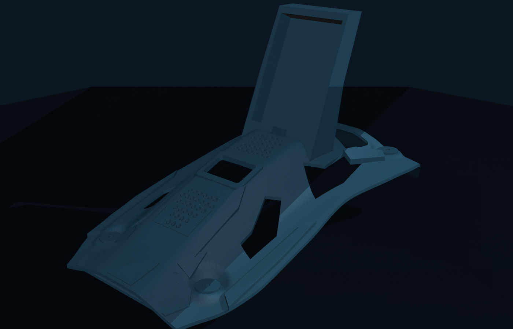

<!--
SPDX-FileCopyrightText: 2026 Tokimi Rover contributors
SPDX-License-Identifier: CC-BY-4.0
-->

# Tokimi Rover top cover — Supercar V3



*CAD render—not a physical rover photo or fit-verification record.*

This directory publishes the project owner's selected final top-cover design:
**Supercar V3 with 195 × 100 mm M3 mounting-hole centers**. It includes the
procedural Blender source, a self-contained editable Blender file, print and
exchange exports, clean renders, software validation evidence, and an A4 1:1
paper fit-check template.

> [!CAUTION]
> The files are owner-approved design artifacts, not evidence that this audit
> physically fitted or printed them. The historical rover record says the
> earlier physical cover used approximately **203 × 105 mm** centers; V3 uses
> **195 × 100 mm**. Measure the current chassis and use the paper template
> before printing. Do not drill, cut, or mount electronics from this model
> without checking the physical vehicle.

## Download the right file

| Need | File | Notes |
|---|---|---|
| Recommended slicer input | [V3 3MF](exports/tokimi_rover_top_cover_supercar_v3_195x100mm.3mf) | Millimetre units; one closed, oriented mesh |
| Slicer fallback | [V3 STL](exports/tokimi_rover_top_cover_supercar_v3_195x100mm.stl) | Binary STL; units are conventionally millimetres |
| Mesh exchange | [V3 OBJ](exports/tokimi_rover_top_cover_supercar_v3_195x100mm.obj) | Millimetre coordinates; one merged cover mesh |
| Editable scene | [V3 BLEND](editable/tokimi_rover_top_cover_supercar_v3_195x100mm.blend) | Self-contained Blender 5.2 scene; generated from the Python source |
| Hole-pattern check | [A4 1:1 PDF](templates/tokimi_rover_top_cover_supercar_v3_m3_fitcheck_195x100mm_A4_1to1.pdf) | Print at Actual Size / 100%; verify the 100 mm line first |
| Machine-readable evidence | [Validation JSON](validation/tokimi_rover_top_cover_supercar_v3_195x100mm_validation.json) | Generator measurements and topology counters |
| Integrity list | [SHA-256 manifest](MANIFEST.sha256) | Checksums for published binary/data artifacts |

The canonical editable source is the procedural chain in [`source/`](source/),
not a parametric STEP, FCStd, or Fusion file. V3 is one merged mesh. No final
STEP or GLB is claimed in this release.

## Design contract

| Property | V3 value |
|---|---:|
| Overall plan | 260 × 155 mm |
| M3 center spacing | 195 × 100 mm |
| Hole diameter | 3.5 mm |
| Front / rear contact planes | z = 15 / 55 mm |
| Nominal roof incline | 11.5922° |
| Nominal shell thickness | 2.5 mm |
| OLED opening | 19 × 36 mm |
| Camera roof clearance | 29 × 78 mm |
| Breadboard target | 85 × 58 × 10 mm |
| Tail drop | 30 mm over x = 227.5–260 mm |

The checked release mesh has 28,734 vertices and 57,760 triangles, a
260 × 155 × 162.9501 mm bounding box, no degenerate triangles, and every
triangle edge paired exactly twice with consistent orientation. These are
software checks only. A fresh 2026-08-19 cad-khana run passed all 20 explicit
V3 assembly assertions and returned `cover.is_valid: true`; an earlier run from
the source design repository had returned `is_valid: false` while those
assertions still passed. The FDM diagnostic also flags a 90° overhang against
its 89° limit, meaning support is required. This package therefore does not
claim vendor certification, support-free printing, or complete printability
validation.

## Paper fit check

1. Open the PDF in a viewer that can print without scaling.
2. Select A4 landscape and **Actual Size / 100%**.
3. Disable Fit, Shrink, Scale-to-page, and borderless expansion.
4. Measure the printed 100 mm calibration line with a physical ruler.
5. Only after that line is correct, place the sheet on the unpowered chassis
   and compare all four hole centers.

The owner's supplied correspondence identifies this V3 3MF and matching A4
sheet as the final pair. That correspondence is not redistributed here and is
not treated as independent physical-validation evidence.

## Rebuild

Tested on 2026-08-19 with Blender 5.2.0 LTS. The standalone export/check tools
were exercised with Python 3.13, NumPy 2.5.1, lib3mf 2.5.0, build123d 0.11.1,
cad-khana 0.0.2, and ReportLab 5.0.0. See [`requirements.txt`](requirements.txt)
for the recorded Python environment; those versions are not bundled.

From this directory:

```sh
blender --background --factory-startup \
  --python source/build_rover_top_cover_supercar_v3.py

blender --background --factory-startup \
  generated/tokimi_rover_top_cover_supercar_v3_195x100mm.blend \
  --python tools/dump_clean_triangulation.py -- generated/top-cover.npz

python tools/npz_to_3mf.py \
  generated/top-cover.npz generated/top-cover.3mf

TOKIMI_CAD_PDF_OUTPUT=generated/fit-check.pdf \
  python tools/generate_m3_fitcheck_pdf.py
```

Blender Boolean operations and lib3mf-generated UUIDs may reorder equivalent
triangles or change archive bytes. Rebuild verification therefore compares
units, dimensions, topology, and the canonical set of triangles; it does not
promise a byte-identical 3MF archive. The checked-in release artifacts remain
locked by `MANIFEST.sha256`.

Generated work belongs under `generated/` and is ignored by Git. To verify the
checked-in package from the repository root, run
`python3 scripts/check_cad_release.py`; the main repository checker calls it as
well.

## License and provenance

The hardware design source and identified manufacturing artifacts in this
directory use `CERN-OHL-W-2.0`; this README uses `CC-BY-4.0`. File notices and
sidecars are authoritative. See [NOTICE.md](NOTICE.md), the repository
[license map](../../../LICENSES.md), and the exact CERN license text in
[`LICENSES/CERN-OHL-W-2.0.txt`](../../../LICENSES/CERN-OHL-W-2.0.txt).

No external styling-reference image is included in or required by the source.
Tokimi names and marks are governed separately by
[TRADEMARKS.md](../../../TRADEMARKS.md).
